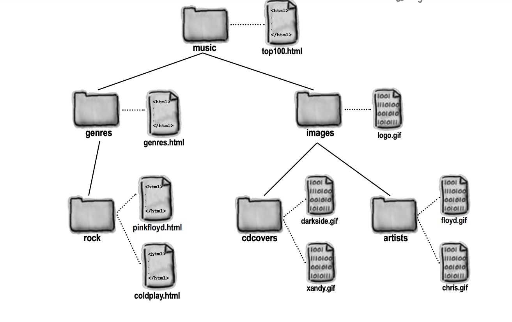

# absolute-and-relative-path

## HTML File Paths

In this exercise, you will learn to use absolute nad relative path in a website where you store webpages, images, link to external stylesheet etc. 
**A file path describes the location of a file in a web site's folder structure.** 

### Absolute File Paths

An absolute file path is the full URL to a file: 
 

#### Example

``

### Relative File Paths

An absolute file path is the full URL to a file: 
 

#### Example

``

# Exersice

## Download/clone this [repo](https://github.com/muratkilic1978/absolute-and-relative-path) to your machine

In the picture below you see an overview with all files and folders that are in this web project. 
 

According to the image below, your task is to find the right path to either an image or a web page. Start with ROUND ONE and open the indicated file top100.html in your editor and write the correct path to the logo.gif image. Then continue to ROUND TWO and so on until you have solved all four exercises. 
 
